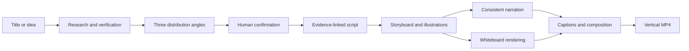

# AI Video Studio · Distribution Engine

[简体中文](README.md) | [English](README.en.md)

Turn a title or rough idea into a research-backed, shareable vertical video with a consistent narrator voice.

AI Video Studio covers the complete path from topic to MP4: web research, fact checking, angle discovery, human confirmation, script writing, AI illustrations, whiteboard drawing animation, voice-over, captions, quality checks, and FFmpeg composition. Whiteboard animation is the default visual language, not the product boundary.

> This is an early, single-node open-source prototype for creators, product validation, and further development. Always review generated facts, rights, and platform compliance before publishing.

## Demo

▶️ [Watch or download the generated whiteboard video](https://github.com/userInner/ai-video-studio/releases/download/v0.1.0/ai-video-studio-demo.mp4)

The demo is a 1080×1920 vertical MP4, approximately 2 minutes 50 seconds long. It includes an AI-written script, consistent narration, AI illustrations, stroke-by-stroke whiteboard animation, captions, and final composition.

## Features

- Start with a specific title, a rough idea, or AI-suggested topics.
- Research current information and build a source-linked fact pack.
- Generate three distinct distribution angles before production starts.
- Write a 3–10 minute narration script with evidence attached to each section.
- Generate warm-paper, pencil-line whiteboard illustrations with an image model.
- Direct hook, timeline, evidence, causal, reversal, and takeaway scenes automatically.
- Render every scene stroke by stroke with the upstream `srt-whiteboard-animation` engine.
- Mix evidence cards, data animations, relationship maps, keywords, and big numbers.
- Detect slow pacing, repeated shots, empty or overcrowded frames, and regenerate weak images.
- Use MiniMax with a stable `voice_id`, or optionally run a locked local Qwen3-TTS voice.
- Export a 1080×1920 H.264/AAC MP4 and separate caption files.
- Store projects, scripts, storyboards, media, and final videos locally with versioning.

## Workflow



## Local deployment with Docker Compose

### Requirements

- Docker Desktop, or Docker Engine with Compose v2
- 8 GB RAM minimum; 16 GB recommended for generating 3–10 minute videos
- At least 20 GB of free disk space

### 1. Clone the repository

```bash
git clone --recurse-submodules https://github.com/userInner/ai-video-studio.git
cd ai-video-studio
cp .env.example .env
```

If you already cloned without submodules, run:

```bash
git submodule update --init --recursive
```

### 2. Configure model providers

Edit `.env` and provide at least the following values:

```dotenv
SUB2API_BASE_URL=https://sub2api.aibro.vip/v1
SUB2API_API_KEY=your_sub2api_key
TEXT_MODEL=gpt-5.6-luna
IMAGE_MODEL=gpt-image-2

MINIMAX_API_KEY=your_minimax_key
TTS_MODEL=speech-2.8-hd
TTS_VOICE_ID=Chinese (Mandarin)_Reliable_Executive
```

The containers can start without API keys, allowing you to inspect the UI and demo topic-selection flow. Real research, AI illustrations, narration, and complete MP4 generation require the corresponding provider credentials.

### 3. Start the application

```bash
docker compose up --build -d
```

Wait until both services are `healthy`:

```bash
docker compose ps
```

Open:

- Web app: <http://127.0.0.1:3000>
- API health check: <http://127.0.0.1:8010/healthz>
- Interactive API docs: <http://127.0.0.1:8010/docs>

The first build downloads the Python and Node.js dependencies and may take several minutes. The SQLite database, illustrations, audio, storyboards, and rendered videos are persisted under `./data` on the host. Rebuilding or restarting containers does not remove them.

### Useful commands

```bash
# Show service status
docker compose ps

# Follow application logs
docker compose logs -f api web

# Restart services
docker compose restart

# Stop services without deleting ./data
docker compose down

# Upgrade after pulling new code
git pull
git submodule update --init --recursive
docker compose up --build -d
```

## Provider configuration

| Purpose | Default provider | Required variables |
|---|---|---|
| Research and script generation | Sub2API / Responses API | `SUB2API_API_KEY`, `TEXT_MODEL` |
| AI illustrations | Sub2API / Images API | `SUB2API_API_KEY`, `IMAGE_MODEL` |
| Voice-over | MiniMax | `MINIMAX_API_KEY`, `TTS_MODEL`, `TTS_VOICE_ID` |

Keep `PREFER_LOCAL_QWEN_TTS=false` for the default CPU-friendly Compose deployment. Provider endpoints and model identifiers can be changed in `.env`. Never commit the `.env` file.

## Local development without Docker

Requirements: Git, Python 3.12, Node.js 20 or later, FFmpeg, and macOS or Linux.

```bash
git clone --recurse-submodules https://github.com/userInner/ai-video-studio.git
cd ai-video-studio
./scripts/setup.sh
# Edit .env and add provider credentials
./scripts/dev.sh
```

The web app runs at <http://127.0.0.1:3000> and the API at <http://127.0.0.1:8010>.

## Optional local Qwen TTS

The default Docker image uses MiniMax and does not include Qwen model weights. Local Qwen requires:

- `services/api/requirements-qwen.txt` in a separate Python 3.12 environment
- Qwen3-TTS VoiceDesign and Base checkpoints
- A stable reference voice file generated during voice design
- A GPU with approximately 24 GB VRAM recommended for the 1.7B locked-voice workflow

Set `PREFER_LOCAL_QWEN_TTS=true` and configure the Qwen paths described in [.env.example](.env.example). For containerized NVIDIA deployment, extend the API image with PyTorch, the Qwen dependencies, model mounts, and NVIDIA Container Toolkit support.

## Project structure

```text
apps/web/                         Next.js web application
services/api/                     FastAPI and media pipeline
packages/whiteboard_engine/       Whiteboard adapter package
vendor/srt-whiteboard-animation/  Upstream renderer submodule
docs/                             Architecture and deployment notes
data/                             Local database and generated media
```

## Tests

```bash
./scripts/check.sh
```

Live provider contract tests are skipped by default. Set `RUN_PROVIDER_TESTS=1` only when you intentionally want to use real provider credits.

## Deployment notes

The included Compose file is intended for local use and private beta deployments. Before exposing it to the public internet, add authentication, HTTPS, rate limiting, media authorization, off-host backups, and a durable job queue. See [docs/deployment.md](docs/deployment.md).

## License and security

- The main project is licensed under the [MIT License](LICENSE).
- The whiteboard renderer is based on [geeklee/srt-whiteboard-animation](https://github.com/geeklee/srt-whiteboard-animation) and retains its MIT license and attribution.
- The repository does not include API keys, model weights, or local user media.
- See [CONTRIBUTING.md](CONTRIBUTING.md), [SECURITY.md](SECURITY.md), and [THIRD_PARTY_NOTICES.md](THIRD_PARTY_NOTICES.md).

## Current limitations

- Long-running media jobs still execute inside the API process and can be interrupted by a service restart.
- SQLite and local files are designed for a single node and do not provide multi-user authorization.
- Natural speech speed can affect the requested 3–10 minute duration.
- Public deployment requires additional security and operational infrastructure.
