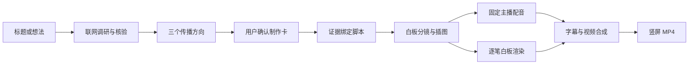

# AI Video Studio · 传播引擎

[简体中文](README.md) | [English](README.en.md)

把一个标题或模糊想法，自动变成有证据、有传播角度、有固定主播配音的竖屏白板视频。

项目覆盖从选题到 MP4 的完整链路：联网调研、事实核验、传播方向、人工确认、脚本、白板插图、逐笔动画、配音、字幕和 FFmpeg 合成。白板是默认视觉能力，不是产品边界。

> 当前阶段是单机开源原型，适合个人创作者、产品验证和二次开发。AI 生成内容发布前仍需人工核验事实、版权与平台规则。

## 在线演示

▶️ [观看或下载 AI 自动生成的完整白板视频](https://github.com/userInner/ai-video-studio/releases/download/v0.1.0/ai-video-studio-demo.mp4)

演示成片为 1080×1920 竖屏 MP4，时长约 2 分 50 秒，包含自动脚本、固定主播配音、AI 插图、逐笔白板动画、字幕与最终合成。

## 功能

- 支持明确标题、模糊想法和 AI 推荐选题三种入口。
- 通过联网搜索生成来源明确的事实核验包。
- 生成三个不同传播角度，由用户确认后才开始制作。
- 生成 3～10 分钟、逐段绑定来源的口播脚本。
- 使用图片模型生成暖纸张、铅笔线条风格的白板画稿。
- 使用抖音视觉导演把每段旁白拆成动态节拍，并自动选择钩子、时间线、证据、因果、反转和总结镜头。
- 使用上游 `srt-whiteboard-animation` 按语义区域逐笔绘制全部场景。
- 限制手部绘制占比，配合关键词、大数字、短字幕和轻运镜，避免整段视频像静态白板课件。
- 自动穿插来源证据截图卡、数据动画和人物关系图，并为每项事实保留来源绑定。
- 自动检测节奏过慢、重复镜头、画面过空或过密；低质量 AI 插图会追加纠正提示并重新生成。
- 默认使用 MiniMax 固定 `voice_id` 配音；可选本地 Qwen3-TTS 锁定主播声纹。
- 输出 1080×1920、H.264/AAC 竖屏 MP4 和独立字幕文件。
- 项目、脚本、分镜、媒体和成片全部版本化并保存在本地。

## 工作流



## Docker Compose 本地部署（推荐）

### 环境要求

- Docker Desktop，或 Docker Engine + Compose v2
- 至少 8 GB 内存；正式生成 3～10 分钟视频建议 16 GB
- 至少 20 GB 可用磁盘空间

### 1. 下载项目

```bash
git clone --recurse-submodules https://github.com/userInner/ai-video-studio.git
cd ai-video-studio
cp .env.example .env
```

如果已经用普通方式克隆，请补充下载白板引擎：

```bash
git submodule update --init --recursive
```

### 2. 配置模型服务

打开 `.env`，至少填写：

```dotenv
SUB2API_BASE_URL=https://sub2api.aibro.vip/v1
SUB2API_API_KEY=你的_SUB2API_Key
TEXT_MODEL=gpt-5.6-luna
IMAGE_MODEL=gpt-image-2

MINIMAX_API_KEY=你的_MiniMax_Key
TTS_MODEL=speech-2.8-hd
TTS_VOICE_ID=Chinese (Mandarin)_Reliable_Executive
```

密钥留空时容器仍能启动，也可以查看界面和演示选题流程；生成真实调研、AI 插图和完整 MP4 必须配置相应服务。

### 3. 一条命令启动

```bash
docker compose up --build -d
```

等待两个服务显示 `healthy`：

```bash
docker compose ps
```

然后打开：

- 网页：<http://127.0.0.1:3000>
- API 健康检查：<http://127.0.0.1:8010/healthz>
- API 文档：<http://127.0.0.1:8010/docs>

首次构建需要下载 Python、Node.js 依赖，通常需要几分钟。项目数据库、插图、配音、分镜和成片全部保存在宿主机 `./data`，重启或重建容器不会丢失。

### 常用命令

```bash
# 查看运行状态
docker compose ps

# 查看实时日志
docker compose logs -f api web

# 重启
docker compose restart

# 停止；不会删除 ./data
docker compose down

# 拉取代码后重新构建
git pull
git submodule update --init --recursive
docker compose up --build -d
```

## 源码方式启动

### 环境要求

- Git
- Python 3.12
- Node.js 20 或更高版本
- FFmpeg
- macOS 或 Linux

### 安装

```bash
git clone --recurse-submodules https://github.com/userInner/ai-video-studio.git
cd ai-video-studio
./scripts/setup.sh
```

编辑 `.env`，至少配置：

```dotenv
SUB2API_BASE_URL=https://your-gateway.example/v1
SUB2API_API_KEY=replace-me
TEXT_MODEL=your-responses-model
IMAGE_MODEL=your-image-model

PREFER_LOCAL_QWEN_TTS=false
MINIMAX_API_KEY=replace-me
TTS_MODEL=speech-2.8-hd
TTS_VOICE_ID=replace-with-a-stable-voice-id
```

启动：

```bash
./scripts/dev.sh
```

打开 <http://127.0.0.1:3000>，API 位于 <http://127.0.0.1:8010>。

更多服务器部署建议见 [docs/deployment.md](docs/deployment.md)。

## 配音选择

| 方案 | 默认 | GPU | 特点 |
|---|---:|---:|---|
| MiniMax `speech-2.8-hd` | 是 | 不需要 | 部署简单，固定 `voice_id`，适合在线服务 |
| Qwen3-TTS VoiceDesign + Base | 否 | 建议 | 本地运行，设计一次声线后克隆锁定，适合私有部署 |

本地 Qwen 需要额外安装 `services/api/requirements-qwen.txt`，并分别准备 VoiceDesign 与 Base 模型。完整环境变量见 [.env.example](.env.example) 和 [docs/providers.md](docs/providers.md)。

## 项目结构

```text
apps/web/                    Next.js 网页
services/api/                FastAPI 与媒体生产链
packages/whiteboard_engine/  白板渲染适配层
vendor/srt-whiteboard-animation/  上游渲染器子模块
docs/                        架构、部署与服务商配置
data/                        本地数据库与媒体，不进入 Git
```

## 测试

```bash
./scripts/check.sh
```

联网服务商契约测试默认跳过；明确设置 `RUN_PROVIDER_TESTS=1` 后才会消耗真实额度。

## 开源与安全

- 主项目使用 [MIT License](LICENSE)。
- 白板引擎来自 [geeklee/srt-whiteboard-animation](https://github.com/geeklee/srt-whiteboard-animation)，保留其 MIT 许可证和原作者归属。
- 本仓库不包含模型权重、API 密钥或本地用户媒体；公开演示成片通过 GitHub Release 提供。
- 请阅读 [CONTRIBUTING.md](CONTRIBUTING.md)、[SECURITY.md](SECURITY.md) 和 [THIRD_PARTY_NOTICES.md](THIRD_PARTY_NOTICES.md)。

## 当前限制

- 长任务仍在 API 进程内运行，服务重启可能中断正在生成的媒体。
- 默认使用 SQLite 和同机文件存储，尚未提供多用户权限。
- 生成时长会受到 TTS 自然语速影响，仍需继续强化 3～10 分钟约束。
- 公网部署前需要补充登录、任务队列、限流、HTTPS 和备份。
