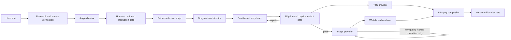

# Architecture

AI Video Studio turns a title or rough idea into a versioned vertical video.

## Components

- `apps/web`: Next.js product UI.
- `services/api`: FastAPI API, workflow orchestration and media pipeline.
- `packages/whiteboard_engine`: stable render profile and renderer adapter.
- `vendor/srt-whiteboard-animation`: upstream renderer Git submodule.
- `data`: local SQLite database, voices, sources and generated media.

## Douyin visual director V2

The visual director separates consistency from variation:

- Brand DNA is fixed: ivory paper, charcoal line work, signal colors, typography and safe areas.
- Shot grammar is selected from a constrained library: hook burst, timeline, evidence stack, causal chain, reversal, checklist and takeaway stamp.
- Each script section is dynamically split into one to five visual beats. Every beat carries a caption, emphasis phrase, visual intent, motion and duration ratio.
- Camera motion and layout change with the narrative role; consecutive scenes are not allowed to repeat the same layout.
- The drawing hand is limited to roughly 36% of a scene. The completed drawing, kinetic emphasis, short captions and camera movement carry the remaining narration.
- Evidence-backed sections can render source screenshot cards; structured numbers and relationships render as local data animations and relationship maps.
- The quality gate measures visual hold time, repeated shot signatures, foreground occupancy and contrast. It repairs rhythm and camera repetition before rendering, then retries low-quality generated illustrations with a corrective prompt.

`services/api/app/visual_director.py` owns this contract and its deterministic
quality audit. It is intentionally model-independent: a future AI director can
produce the same contract without changing the renderer.

Quality results are stored inside the storyboard and per-scene media metadata.
`MEDIA_QUALITY_MAX_RETRIES` controls how many paid image regenerations may be
attempted after the initial frame fails the deterministic quality gate.

## Provider boundaries

- Research, direction and script generation use a Responses-compatible model gateway.
- Illustrations use an OpenAI Images-compatible gateway.
- Speech uses MiniMax by default, or optional local Qwen3-TTS.
- Rendering and final video composition stay local.

Provider responses are converted into internal contracts before entering the
workflow. Media files are written atomically and identified by hashes.

## Current scope

The current release is a single-node product prototype. Workflow state is
persisted, but long-running work still executes from the API process. Public
multi-user deployment should move media work to a dedicated queue, add
authentication and replace SQLite with PostgreSQL.
