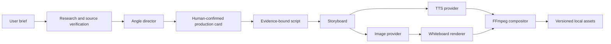

# Architecture

AI Video Studio turns a title or rough idea into a versioned vertical video.

## Components

- `apps/web`: Next.js product UI.
- `services/api`: FastAPI API, workflow orchestration and media pipeline.
- `packages/whiteboard_engine`: stable render profile and renderer adapter.
- `vendor/srt-whiteboard-animation`: upstream renderer Git submodule.
- `data`: local SQLite database, voices, sources and generated media.

## Provider boundaries

- Research, direction and script generation use a Responses-compatible model gateway.
- Illustrations use an OpenAI Images-compatible gateway.
- Speech uses MiniMax by default, or optional local Qwen3-TTS.
- Rendering and final video composition stay local.

Provider responses are converted into internal contracts before entering the
workflow. Media files are written atomically and identified by hashes.

## Current scope

The current release is a single-node product prototype. Workflow state is
persisted, but long-running work still executes from the API process. Public
multi-user deployment should move media work to a dedicated queue, add
authentication and replace SQLite with PostgreSQL.
